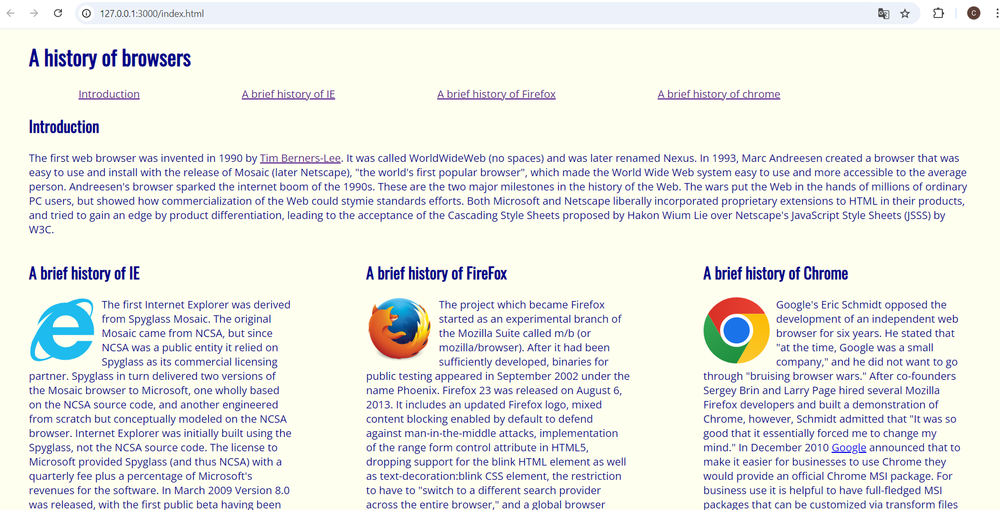
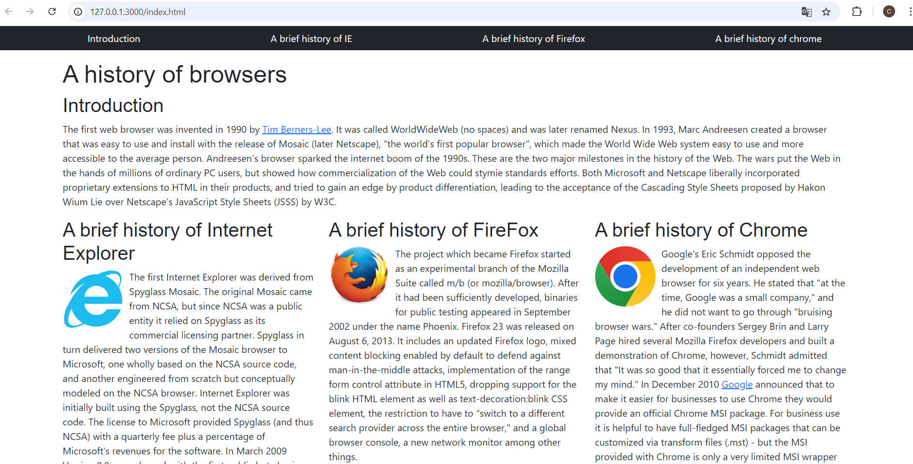

Bootstrap has become the world’s most popular framework for building responsive, mobile-first websites. There has to be a reason for this, right? Given the rise of UI frameworks like Bootstrap 5, one might wonder why so many developers invest their time in learning these tools instead of sticking to good old HTML and CSS. Here is why I choose to invest my time in learning the Bootstrap framework.  

### My first encounter with Bootstrap 5
As someone who’s still fairly new to HTML and CSS, I was a bit scared to start using Bootstrap 5 to create web pages, but I quickly started enjoying it. I found it really cool to see how quickly I could build something that looked polished and professional using Bootstrap’s pre-designed components. Adding things like a navigation bar or footer was so much easier than I expected. However, I soon realized that understanding the code wasn’t straightforward. Bootstrap relies heavily on utility classes, which meant a lot of the styling was happening right inside the HTML. This made it tough to figure out how to make small tweaks, like moving a logo just a bit more to the right. I often found myself struggling to know which class to use or where to make adjustments without breaking the layout. Even though it was a challenge, I learned that mastering Bootstrap is all about balancing its powerful shortcuts with a solid understanding of how those classes are actually affecting the design.

### Bootstrap in action
To better illustrate the impact of using Bootstrap 5, let’s look at a visual comparison between two versions of the same webpage. The first version was built using only raw HTML and CSS, while the second version leverages Bootstrap 5 to enhance its design 

  
  
<em>Without Bootstrap: Basic layout with no navigation bar</em>

  
  
<em>With Bootstrap 5: Enhanced design with a navigation bar and improved responsiveness</em>

As you can see, the Bootstrap 5 version of the webpage includes a clean, well-structured navigation bar with minimal effort. It also has a more cohesive layout, making the page more visually appealing and easier to navigate. This transformation shows how Bootstraps' built-in components can save time while still creating a professional look. This was my first time using Bootstrap 5, and I really liked how fast and easy I could make my webpage look better by using Bootstrap. 

### Why bother learning Bootstrap 5
Given the challenges and the initial frustration of not understanding how everything works, why should anyone bother to learn Bootstrap 5 instead of just sticking with raw HTML and CSS? The answer is simple: efficiency and scalability. Using Bootstrap significantly speeds up the development process by providing a vast library of pre-designed components and responsive grid systems. Instead of spending hours creating a layout from scratch, you can simply use Bootstrap’s classes to build a cohesive and mobile friendly design in minutes.

### Conclusion
In the end, using Bootstrap 5 is like having a toolbox filled with shortcuts that make web development easier and more enjoyable. While it can be challenging to navigate its built-in styles and utility classes at first, the benefits of clean, responsive and professional looking websites far outweigh the initial struggles. For someone like me, who is still learning the ropes of HTML and CSS, I’m looking forward to continue to develop my skills using Bootstrap. Although I know I will stumble and struggle on the way, it will be worth it in the end when I can create beautiful, responsive webpages that I’m proud of.

