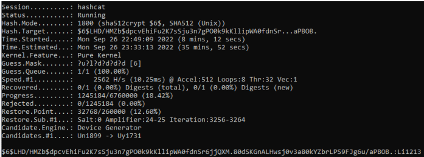

For this project I was given a hash, and my job was to crack the password using brute force. In this project I had to get familiar with using the Windows Command Promt. 

The hash that I was given looked like this:

_cli:$6$LHD/HMZb$dpcvEhiFu2K7sSju3n7gPO0k9kKllipWA0fdnSr6jjQXM.80dSKGnALHwsj0v3a80kYZbr
LPS9FJg6u/aPBOB.:19235:0:99999:7:::_

I started by saving the given hash as a text file called weakpwd.txt. By using hashcat I was able to type in the following command in cmd promt:
_hashcat -a 3 -m 1800 weakpwd.txt ?u?1?d?d?d?d_

The "-a 3" part means that the attacking mode is brute force, "-m 1800" means that the mode of the hash function is sha512crypt

After a lot of running I was finally able to crack the password which can be seen in the picture below on the bottom right side:

  

