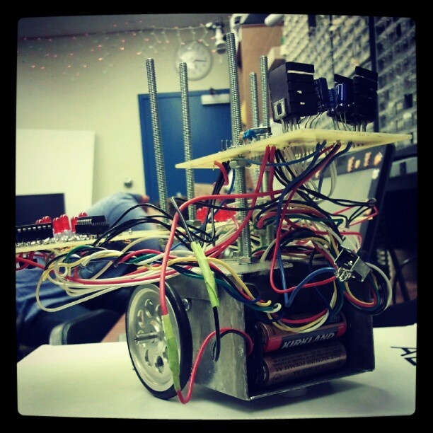

<div class="text-center p-4">
  
  
  
</div>

For this project I worked in a team of four. Given a tabular data set that contained information about every fishery operations in Norwegian waters, our goal was to predict the fish weight for a single catch operation. To do this we trained multiple different machine learning models, and tested which one was best. 

For this project we had to start with a lot of preprocessing. The purpose of this part was to fully understand the date we were working with, visualize it and prepare it for the machine learning algorithms. After preparing the data we trained multiple different supervised models such as inear regression, random rorest regression and multilayer preception (MPL). 

After this part we also used unsupervised learning by K-means clustering, which was my main responsibility for this project. K-means clustering is learning patterns and structures from input features without any explicit supervision. The goal of this part was to visualize clusters in our original high-dimensional data as well as after using PCA for dimensionality reduction.


Here is some code that illustrates how we read values from the line sensors:

```cpp
byte ADCRead(byte ch)
{
    word value;
    ADC1SC1 = ch;
    while (ADC1SC1_COCO != 1)
    {   // wait until ADC conversion is completed   
    }
    return ADC1RL;  // lower 8-bit value out of 10-bit data from the ADC
}
```

You can learn more at the [UH Micromouse News Announcement](https://manoa.hawaii.edu/news/article.php?aId=2857).
