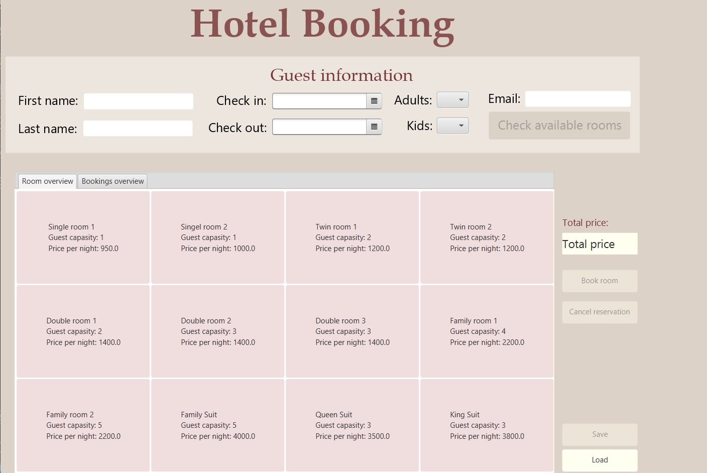

## Project Overview
My teammate and I developed a full-featured Hotel Booking System using Java and JavaFX, demonstrating clean object-oriented design principles and modern development practices. The system allows users to manage hotel room bookings through a graphical interface while maintaining data persistence.


Here is a photo illustrating how the app looks like:

<p align="left">
  
</p>


## Key Technical Features

### 1. Smart Booking Logic
One of the core features is the intelligent booking validation system that prevents double bookings and ensures room capacity isn't exceeded:

```java
public void bookRoom(Room room, Guest guest) {
    if(!checkValidGuests(guest, room)){
        throw new IllegalArgumentException("Dette rommet har ikke plass til så mange gjester");
    }

    if (!bookedDates.containsKey(getBookedRoomID()) && checkValidGuests(guest, room)){
        bookedDates.put(getBookedRoomID(), new ArrayList<ArrayList<LocalDate>>());
        bookedDates.get(getBookedRoomID()).add(guest.getListOfBookedDates());
    } else {
        if (checkValidDates(guest) && checkValidGuests(guest, room)){
            bookedDates.get(getBookedRoomID()).add(guest.getListOfBookedDates());
        } else{
            throw new IllegalArgumentException("Rommet kan ikke bookes innen disse datoene");
        } 
    }
}
```

### 2. Dynamic Pricing System
We implemented a flexible pricing system that includes dynamic discounts based on the number of children:

```java
private double calculateDiscount(Integer kids){
    if (kids == 0){
        discount = 1;
    } else if (kids == 1){
        discount = 0.9;
    } else if (kids == 2){
        discount = 0.85;
    }else {
        discount = 0.8;
    }
    return discount;
}

public double setTotalPrice(Room room, LocalDate checkIn, LocalDate checkOut, int kids){
    totalPrice = room.getPrice() * getNights(checkIn, checkOut) * calculateDiscount(kids);
    return totalPrice;  
}
```

### 3. Clean GUI Integration
The application uses JavaFX with FXML for a clean separation of concerns. Here's the main application setup:

```java
public class HotelBookingApp extends Application {
    @Override
    public void start(Stage primaryStage) throws IOException {
        primaryStage.setTitle("Hotel Booking");
        primaryStage.setScene(new Scene(FXMLLoader.load(
            getClass().getResource("HotelBookingApp.fxml"))));
        primaryStage.show();
    } 
}
```

### 4. Robust Testing
We implemented comprehensive unit tests to ensure reliability:

```java
@Test
@DisplayName("Tests if booking is valid")
public void testBookRoom(){
    assertThrows(IllegalArgumentException.class , () -> {
        booking.bookRoom(room, guest);
    }, "Throws exception when there are more guests than room capacity");

    bookedDates.put("Suit", new ArrayList<ArrayList<LocalDate>>());
    bookedDates.get("Suit").add(bookedDates1);
    assertEquals(List.of(bookedDates1), bookedDates.get("Suit"));
}
```

## Technical Challenges & Solutions

### Date Management
One of the key challenges was managing booking dates and preventing conflicts. We solved this by implementing a robust date validation system:

```java
public void setCheckInDate(LocalDate checkIn) {
    if (!(checkIn.isAfter(LocalDate.now().minusDays(1)))){
        throw new IllegalArgumentException(
            "Check-in must be after current date"
        );
    }
    this.checkIn = checkIn;  
}
```

### Data Persistence
We implemented a file-based storage system with proper error handling:

```java
@FXML
private void handleSave(ActionEvent event){
    try {
        bookingsFile.deleteBookingFromFile("bookingsFile");
        for (Booking booking : bookingsTableView.getItems()){ 
            bookingsFile.writeBooking("bookingsFile", booking);    
        }
        showMessage("Bookings saved successfully");
    } catch (Exception e) {
        showErrorMessage(e.getMessage());
    }
}
```

## Technical Stack
- Java 17
- JavaFX for GUI
- JUnit 5 for testing
- Maven for build automation

## Learning Outcomes
- Deepened understanding of OOP principles including encapsulation and inheritance
- Gained practical experience with JavaFX and FXML
- Improved testing practices using JUnit
- Enhanced error handling and input validation techniques

## Future Improvements
- Integration with a proper database system
- Implementation of user authentication
- Addition of advanced search and filtering capabilities
- Integration of a payment processing system


You can see the whole project at my [TDT4100 repository](https://github.com/chrshol/TDT4100.git).
