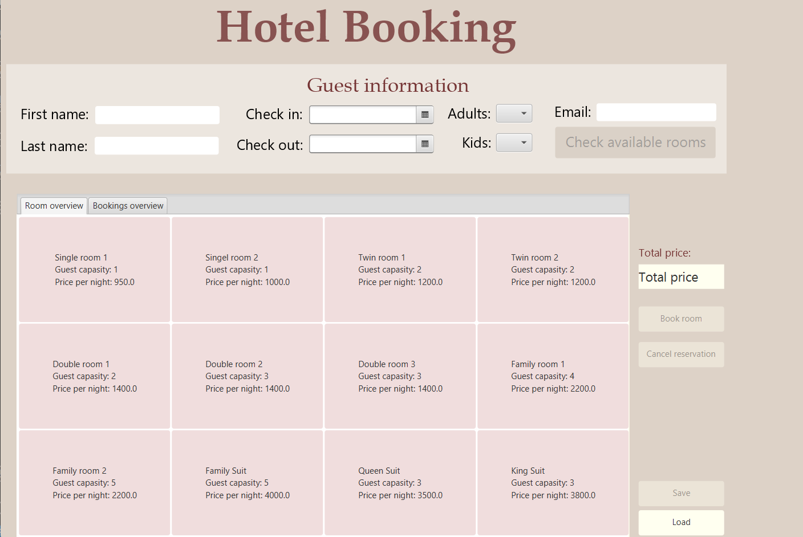

The goal of this project was to get familier with object oriented programming using Java. We worked in pairs of two and we were free to choose whater project we wanted. My teammate and I landed on making a Hotel Booking App. This project was my first team coding project, and gave me the opportunity to learn pair programming and gain experience with using Git.

In this project me and my partner developed a functional app consisting of several classes. We ensured that all classes encapsulate tehir state and include validation when state changes occur. The user interface was created using FXML, supported by Controller and App classes. Additionally, the app features the ability to read from and write to a file, making it useful for storing data such as a list of all bookings. Appropriate error handling was implemented throughout the app, and we created a set of JUnit tests to verify that the app's functionality works as intended

Here is a photo illustrating how the app looks like:

  

You can see the whole project at my [TDT4100 repository](https://github.com/chrshol/TDT4100.git).
