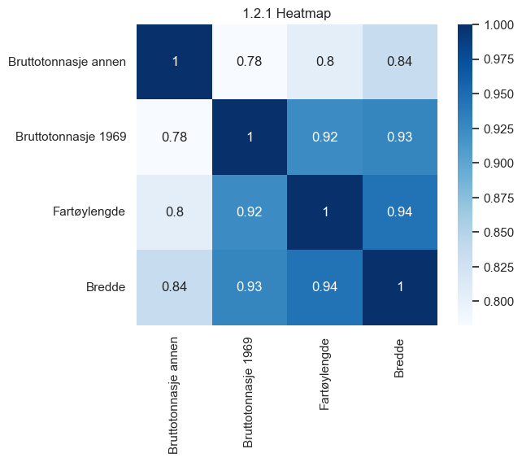
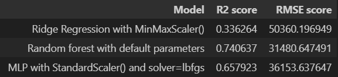
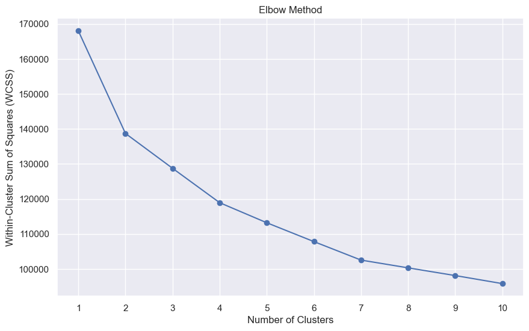
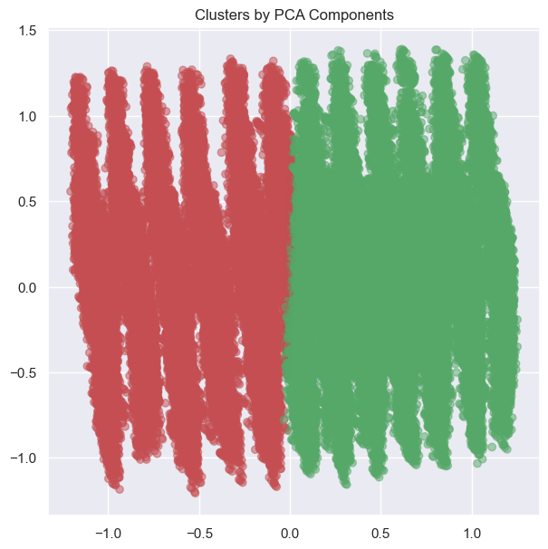

## Project Overview
In this group project, we developed machine learning models to predict the total weight of fish catches from Norwegian fishing vessels. Using a dataset containing over 300,000 fishing operation reports from 2018, we implemented and compared various regression models including Linear Regression, LASSO, Ridge, Random Forest, and Neural Networks (MLP).

## The Challenge
Norwegian fishing vessels are required to report detailed information about their fishing operations. This creates a rich dataset including vessel specifications, location data, and catch details. Our goal was to use this data to create accurate predictions of catch weights, which could help in fleet management and resource planning.

## Data Preprocessing
The raw data required significant preprocessing:
- Handled missing values (approximately 2.57% of rows contained NaN values)
- Converted datetime information into usable features
- Engineered new features like trip duration and distance traveled
- Grouped data by fishing trips to create meaningful aggregates
- Scaled features using various methods for different models




## Model Development
We implemented several machine learning approaches, progressively improving our predictions:

### Linear Models
```python
# Example of our Ridge Regression implementation
ridge_reg = make_pipeline(MinMaxScaler(), 
                         Ridge(alpha=0.001, random_state=42))
ridge_reg.fit(X_train, y_train)
```

### Advanced Models
```python
# Our best performing model: Random Forest
forest = RandomForestRegressor(random_state=42)
forest.fit(X_train, y_train)
forest_predicted_values = forest.predict(X_val)
```


## Results
Our model comparison showed clear differences in prediction accuracy:



The Random Forest model significantly outperformed other approaches, explaining 74% of the variance in catch weights. This suggests that non-linear relationships in the data are important for accurate predictions.

## Clustering Analysis
We also performed unsupervised learning using K-means clustering to identify patterns in fishing operations:



Using PCA for dimensionality reduction, we identified two distinct clusters in the data:



## Key Learnings
- Complex models (Random Forest, MLP) significantly outperformed linear models, suggesting non-linear relationships in fishing data
- Vessel size features proved crucial for prediction accuracy
- PCA helped reveal underlying patterns in high-dimensional fishing operation data
- The importance of proper data preprocessing in handling real-world datasets

## Technologies Used
- Python
- scikit-learn
- Pandas
- NumPy
- Matplotlib/Seaborn
- Plotly

## Future Improvements
- Implement Bayesian optimization for hyperparameter tuning
- Explore feature importance in clustering results
- Investigate the impact of seasonal patterns
- Test models on data from different years


